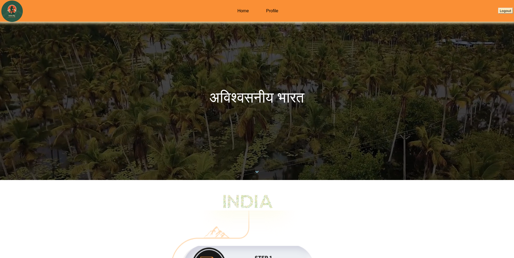
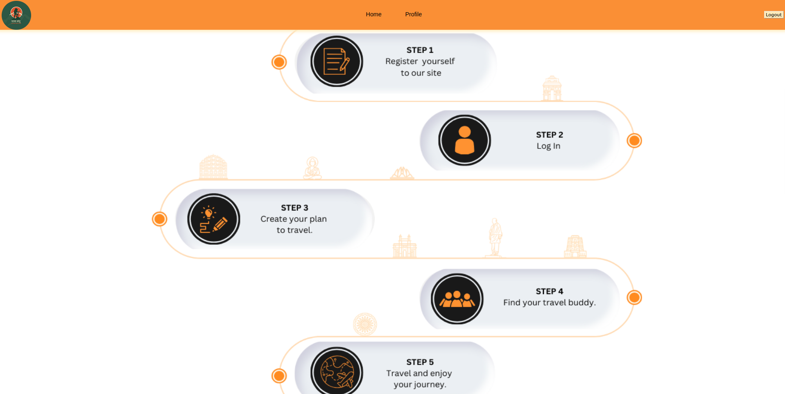

# Yatra Bandhu

Yatra bandhu is a WebApp which helps users to plan thier own customized trips with the help of AI. It let's user connect to other travelers on the basis of their choices. Our main aim is to plan best trips for users and also help them find their own travelling buddies.

## Features
* AI enabled trip planner
* Customizable trips
* User database
* Finding travelling buddies of similar interests

## Pre Requesites
This project has to be run locally as of now. The required dependencies to run the project our as follows:
* Python 3.6 or better
* Django 4.5 or better
* django-crispy-forms
* crispy-bootstrap
* pillow

## Installation
To install all the required dependencies in your project start up a python virtual enviornment.

* Start up with a python virtual enviornment:
    
    `python -m venv venv`
        
    To activate the python enviornment 

    `source venv/bin/activate`

* To make things easier i have added a requirements.txt file which contains the name of the pre requisites to install them:

    `pip install -r ./requirements.txt`

## Getting Started 

Now that all the dependencies are installed. To startup our project follow the below guidelines:

1. Start up with a python virtual enviornment or use the one in which you have installed the packages:
    
    `python -m venv venv`
    
    To activate the python enviornment 

    `source venv/bin/activate`

2. In the virtual envoirnment CLI:

    `python manage.py runserver`

    This run a live server by default on **http//localhost:8000/** click on it to see the website on a browser

3. Congrats you have successfully installed and run a django project.

## Acknowledgements

This project is made by team **HyperText Assassins** in WittyHacks hackathon.

- **Aryan Sharma (Frontend Developer) :** Created a eye catching and user interface.
- **Aarya Jamwal (Backend Developer) :** Created the backbone of the website for seamless backend operations.
- **Akshat Verma (ML Developer) :** The main member behind our AI enabled customizable trip planner.